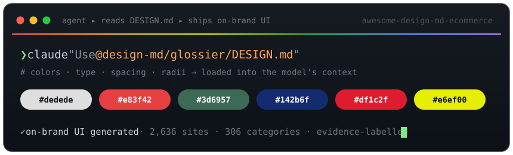

<div align="center">

<p><a href="https://sealeap.cn/"></a></p>

# 🎨 awesome-design-md-ecommerce



### Design systems your AI agent can actually read.

**An evidence-qualified collection of e-commerce design references** for AI coding agents. Files describe observed CSS values and inferred design interpretations; each lists its limitations.

[](https://awesome.re)
[](https://sealeap.cn/)
[](./INDEX.md)
[](./INDEX.md)
[](#-quickstart)
[](./LICENSE)
[](./CONTRIBUTING.md)
[](https://github.com/xjli360/awesome-design-md-ecommerce/stargazers)

[**SeaLeap projects**](#sealeap-open-source-projects) · [**Why**](#-why-this-exists) · [**See it**](#-see-it-in-action) · [**Quickstart**](#-quickstart) · [**The collection**](#-the-collection) · [**Full index →**](./INDEX.md) · [**Contribute**](./CONTRIBUTING.md) · [**About SeaLeap**](#about-sealeap)

</div>

---

## SeaLeap open-source projects

Explore the companion projects for Amazon operations, multi-platform commerce, and e-commerce interface design:

| Project | What it helps you do |
| --- | --- |
| [sealeap-amazon-skills](https://github.com/xjli360/sealeap-amazon-skills) | Use Agent Skills for Amazon product research, listings, advertising, inventory, and operations. |
| [sealeap-ecommerce-skills](https://github.com/xjli360/sealeap-ecommerce-skills) | Run product research, operations, and advertising workflows for Shopify, Etsy, eBay, TikTok Shop, Walmart, Mercado Libre, and OZON. |
| [awesome-design-md-ecommerce](https://github.com/xjli360/awesome-design-md-ecommerce) (this repo) | Give AI agents e-commerce brand `DESIGN.md` references for storefronts, product pages, and branded interfaces. |

## 💡 Why this exists

AI coding agents are great at *structure* and bad at *taste*. Ask one for a landing page and you get the same rounded-blue-button, Inter-on-white, faintly-gray template every time — because that's the statistical average of everything it has ever seen.

A `DESIGN.md` fixes that. It's a single plain-text file that captures **one storefront's design interpretation** — its palette, type scale, spacing, radii, and component patterns — the visual characteristics associated with that storefront. Drop it into your agent's context and the UI it produces can use the documented palette, type and component guidance, while respecting its evidence limitations.

> CSS value presence is evidence of a value, not proof of its semantic role. New files include `SOURCE.json`; older files are marked `historical_unverified` in the manifest.

**Who it's for** — design engineers prototyping on-brand UI · agencies pitching brand-faithful mockups · indie hackers who want their MVP to *not* look like an MVP · anyone building with Claude Code, Cursor, Copilot, or v0.

## 👀 See it in action

A `DESIGN.md` is human-readable and agent-readable at once. Here's a slice of [`design-md/glossier/DESIGN.md`](./design-md/glossier/DESIGN.md):

```yaml
---
name: Glossier
description: >
  A brand that lives in the gap between #dedede and #121212 — a pale, almost-warm
  gray and a near-black that together create a system of extreme restraint. The
  canvas is not white but a soft, foggy gray that reads as a studio backdrop,
  making every product the hero. Buttons are pill-shaped, cards softly rounded,
  and the whole experience breathes through generous whitespace.
---

colors:
  primary:       "#dedede"   # foggy gray — the signature "studio backdrop"
  ink:           "#121212"   # near-black, used sparingly
  canvas:        "#f5f5f5"
  accent-pink:   "#f4a2b8"

typography:
  display-xl:
    fontFamily:  "'GT America', -apple-system, sans-serif"
    fontSize:    36px
    fontWeight:  400
    lineHeight:  1.2
    letterSpacing: -0.5px

rounded:   { md: 8px, full: 9999px }   # softly-rounded cards, pill buttons
```

Hand it to your agent:

```text
Build a hero section for a face serum.
Use the attached DESIGN.md — match its colors, typography, radii, and
spacing consistently. Treat inferred values as proposals and keep Known Gaps visible.
```

…and the output comes back in foggy gray with pill buttons and GT America — Glossier, not Bootstrap. Every file also documents its own **Known Gaps**, so the agent knows what was *not* reliably captured.

## 🚀 Quickstart

1. **Find a brand** in [the collection](#-the-collection) or the [full index](./INDEX.md).
2. **Give the file to your agent** as context.
3. **Ask it to build** — it now has a documented design reference, with explicit gaps.

**Claude Code**
```bash
claude "Build a product page for a ceramic kettle using @design-md/caraway/DESIGN.md — use its documented tokens and respect its Known Gaps."
```

**Cursor / Copilot / Windsurf** — drag the `DESIGN.md` into chat (or `@`-mention it), then prompt as above.

**v0 / Lovable / bolt** — paste the file contents at the top of your prompt.

## 📐 What's inside each `DESIGN.md`

Nine sections, every file, in the same order — see the full spec in [`CONTRIBUTING.md`](./CONTRIBUTING.md).

| Section | What it captures |
|---|---|
| **Description** | An evidence-grounded editorial read of the brand's design philosophy & voice |
| **`colors`** | Semantic tokens → hex: neutrals, surfaces, accents, semantic roles |
| **`typography`** | Full type scale — `fontFamily`, `fontSize`, `fontWeight`, `lineHeight`, `letterSpacing` |
| **`rounded`** | Border-radius scale (`xs`–`full`) |
| **`spacing`** | Spacing scale (`xxs`–`section`) |
| **`components`** | Buttons, cards, inputs, nav — as token references |
| **Components** *(prose)* | Each component described with its state variants |
| **Responsive Behavior** | Breakpoints, touch targets, collapse strategy |
| **Known Gaps** | What couldn't be extracted reliably — stated honestly |

## 📚 The collection

<!-- collection-stats:start -->
**2,636 unique website URLs · 2,733 DESIGN.md files · 306 categories.**

Target: 2,817 unique URLs from 3,000 selected records; **181 unique URLs remain**. Historical aliases are preserved. See [collection status](./STATUS.md) for unresolved sources and [the manifest](./data/manifest.json) for canonical IDs, category tags, validation and evidence status.
<!-- collection-stats:end -->

Browse everything in **[`INDEX.md →`](./INDEX.md)**.

<!-- domain-table:start -->
| Domain | Unique websites |
|---|--:|
| More | 1056 |
| Tech & Computing | 242 |
| Books & Media | 186 |
| Home & Living | 165 |
| Outdoor & Garden | 162 |
| Gaming & Collectibles | 141 |
| Baby & Kids | 128 |
| Beauty & Personal Care | 119 |
| Music & Instruments | 112 |
| Stationery & Desk | 105 |
| Kitchen & Cookware | 95 |
| Sport & Fitness | 70 |
| Health & Wellness | 55 |
<!-- domain-table:end -->

### ⭐ Featured brands

A few you'll recognize — each links to its full spec:

| Brand | Design signature |
|---|---|
| [**Glossier**](./design-md/glossier/DESIGN.md) | Foggy-gray studio canvas, near-black ink, pill buttons — extreme restraint |
| [**Aesop**](./design-md/aesop/DESIGN.md) | Deliberate restraint; texture, weight, and quiet typographic authority |
| [**The Ordinary**](./design-md/ordinary/DESIGN.md) | Stark white canvas, one clinical red (`#e83f42`) as the only release |
| [**Drunk Elephant**](./design-md/drunk-elephant/DESIGN.md) | Clinical apothecary crossed with a colorful candy shop |
| [**Fenty Beauty**](./design-md/fenty-beauty/DESIGN.md) | Inclusive, high-contrast, sculptural — rewrote the category's palette |
| [**Caraway**](./design-md/caraway/DESIGN.md) | Warm, design-led ceramic cookware that belongs on the counter |
| [**Our Place**](./design-md/our-place/DESIGN.md) | The shared table as the brand's whole thesis |
| [**Hexclad**](./design-md/hexclad/DESIGN.md) | Steel-meets-nonstick hybrid tension, made visual |
| [**Made In**](./design-md/made-in/DESIGN.md) | Rugged utility balanced with restrained elegance |
| [**Parachute**](./design-md/parachute/DESIGN.md) | Whispers of linen and stone — warm, tactile home |
| [**Brooklinen**](./design-md/brooklinen/DESIGN.md) | Premium-casual voice on a deep-navy anchor and off-white canvas |
| [**Casper**](./design-md/casper/DESIGN.md) | Trustworthy sleep-first blues with accent-driven energy |
| [**Hay**](./design-md/hay/DESIGN.md) | Danish: soft contrasts, muted earth tones, material honesty |
| [**Blueland**](./design-md/blueland/DESIGN.md) | A color-coded refill system — yellow citrus, mint eucalyptus |
| [**Ritual**](./design-md/ritual/DESIGN.md) | A single deep navy (`#142b6f`) carried as the entire identity |
| [**Hims**](./design-md/hims/DESIGN.md) | Apothecary sage green instead of clinical telehealth blue |
| [**Peloton**](./design-md/peloton/DESIGN.md) | Near-black canvas with a single red voltage (`#df1c2f`) |
| [**Dyson**](./design-md/dyson/DESIGN.md) | FoundryGridnik industrial sans — product-grade authority, on screen |

**→ [Browse all 2,636 canonical websites in `INDEX.md`](./INDEX.md)**

## 🛠️ How it's made

Every spec is produced by an automated, resumable pipeline ([`scripts/`](./scripts)):

1. **Crawl** the live storefront and extract real CSS — color values, font stacks, radii, spacing.
2. **Retain evidence** with source URLs, HTTP status, capture time and content hashes. Empty or blocked captures remain on hold.
3. **Generate** a `DESIGN.md` with Claude from captured CSS evidence, labelling inferred roles and measurements.
4. **Validate** real YAML syntax, schema, duplicate keys, token references and evidence allowlists before writing.
5. **Reconcile** canonical website identities and rebuild the index, CSV, manifest and counts.

These are best-effort extractions of public, observable design decisions — each file states its own **Known Gaps**. Provenance (slug, category, source URL) for every brand lives in [`data/brands.csv`](./data/brands.csv).

## 🤝 Contributing

PRs welcome — one brand per PR. Pick a genuinely DTC brand, add `design-md/<slug>/DESIGN.md` following the nine-section spec, and open a PR. Full guidelines in [`CONTRIBUTING.md`](./CONTRIBUTING.md).

## 🔗 Related

- [`awesome-design-md`](https://github.com/VoltAgent/awesome-design-md) — the original `DESIGN.md` format and spec this project follows. It curates ~73 developer-focused sites; this list is its e-commerce counterpart — a broad range of commerce categories, the long tail of real storefronts.

## 📄 License

[MIT](./LICENSE) — design tokens describe publicly observable facts about brand interfaces; all trademarks belong to their respective owners.

<div align="center">

---

**If this helps your agent build better UI, leave a ⭐ — it genuinely helps.**

Maintained by [SeaLeap](https://sealeap.cn/).

</div>

## Reproduce and resume

```bash
uv run --with pyyaml python scripts/check_format.py
uv run --with pyyaml python scripts/build_index.py
uv run --with pyyaml python scripts/worker_claude.py --target 200 --batch-id my-batch
```

`data/sites.csv` contains the selected input records. Install and authenticate Claude CLI separately. Reuse the same batch ID to resume; the target is successful new canonical websites, not attempts. Add `--retry-failed` to retry transient failures in that batch. A process lock prevents duplicate workers. No publishing or git operations are performed.

To review every remaining canonical URL, use `--all-remaining --target 397 --batch-id remaining-review` (the target is informational in this mode). The batch ends as `reviewed`; held sources remain incomplete and are listed in [STATUS.md](./STATUS.md). Resume with the same ID; `--retry-slugs slug-a slug-b` retries selected unresolved entries after source corrections. Successful existing documents are never regenerated by this option.

After an exhaustive review, `scripts/export_review.py <batch-id> --capture-root <recovery-root>` records unresolved sources in `data/source_holds.json`; run `scripts/build_index.py` to rebuild the public status page. Temporary access failures remain retryable. Holds marked `manual_review_required` need a source/identity review before release.

For JavaScript-only sites, `scripts/capture_rendered.py` optionally captures an anonymous desktop page, styles and a screenshot with Playwright. It does not log in or solve access challenges. Pass its output root to the worker with `--evidence-root`; snapshot hashes and source URL must match before generation. Screenshots are local evidence, not a visual-fidelity guarantee or bundled brand assets.

## About SeaLeap

**SeaLeap aims to build the world's largest AI cross-border e-commerce community.** We bring together cross-border sellers, brand teams, operators, and AI developers to exchange practical experience in product research, advertising, content, data analysis, and operations automation.

The community offers practical discussions, commerce news, and a Skill Hub where people and Agents turn experience into reusable Skills, tools, and workflows. SeaLeap maintains these three open-source projects. Join us to share your work, ask questions, and improve your next workflow with the community.

<div align="center">
  <p><strong>Shared knowledge. Open-source tools. Practical progress.</strong></p>
  <p><a href="https://sealeap.cn">Visit SeaLeap · Join the community</a> · <a href="https://sealeap.cn/skills">Explore the Skill Hub</a></p>
</div>
